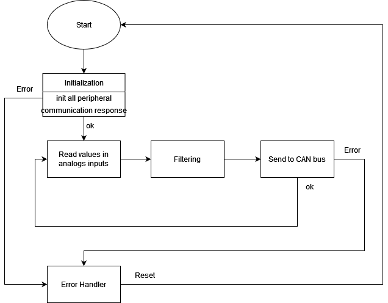

#PUTM_EV_Data_Acquisition_Card_2022

## About project
Its main task is to receive signals from sensors mounted on the car and analyze them and sent to CAN-bus.

## Hardware design
The hardware part of the project is the PCB board which is connected to the sensors and CAN-bus. The microcontroller which is used is STM32L4P5RET6. The PCB is supply by 5VDC.

## Sensors
It receive signals from :   
 - inductive sensors - there are used to measure wheels rotation speed
 - pressure sensor - which measure the pressure in the brake system
 - kill-switches - signals for the switches
 - acceleration - from MPU on board

## Chart
