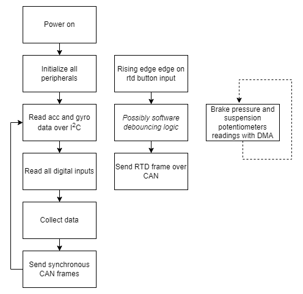

# PUTM_EV_Data_Acquisition_Card_2022

## About the project
It's main task is to receive signals from sensors mounted on the car and analyze them and send to CAN-bus.

## Hardware design
The hardware part of the project is the PCB board which is connected to the sensors and CAN-bus. The microcontroller which is used is STM32L4P5RET6. The PCB is supply by 5VDC.

## Sensors
It receive signals from :   
 - ~~inductive sensors - there are used to measure wheels rotation speed~~
 - brake pressure sensors - which measure the pressure in the brake system
 - shutdown circuit sense:
1. BSPD
2. Overtravel switch
3. Driver's kill switch
4. Left and right kill switches
 - acceleration - from MPU on board

## Program flow diagram

)

## DMA and ADC timings consideration

The program is required to collect and relay data @ 100 ms.
Two adc peripherals are used to collect data from 3 analog sensors each.

* * *
ADC clock frequency: $32 MHz$

Sampling time: $92.5$ cycles - **reason:** High impedance inputs are used, subject to change

Oversampling: by 256

Sample conversion time: $T_{sample} + 12.5 = 105 cycles$

With oversampling: $T_{total} = 105 cycles * 256 samples = 26880 cycles$

$$
t = \frac{26800 * 3 channels}{32 * 10^6 Hz} = 2.52 * 10^{-3} s = 2.52 ms
$$

*Timer synchronization to avoid unnecessary measurements?*  